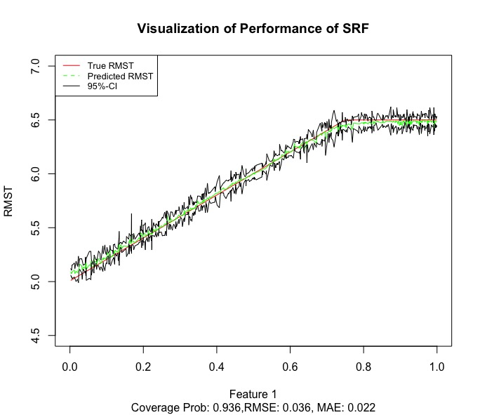
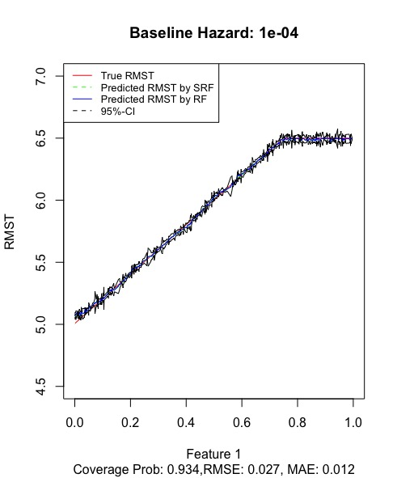
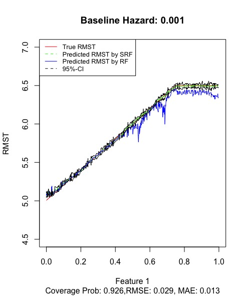
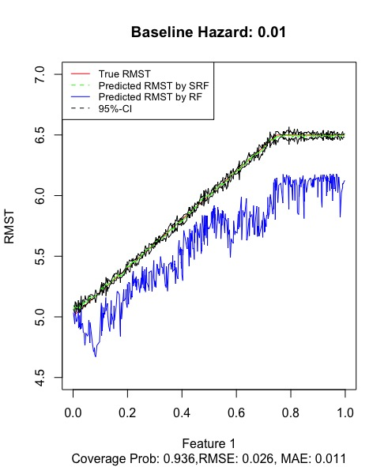

[](https://travis-ci.org/grf-labs/grf)


# SRF: Survival Random Forest

SRF is built upon grf package for forest-based statistical estimation and inference. SRF currently provides non-parametric approach for estimating restricted mean survival regression.

SRF supports 'honest' estimation (where one subset of the data is used for choosing splits, and another for populating the leaves of the tree), and confidence intervals for restricted mean survival regression.

This package is currently in beta, and we expect to make continual improvements to its performance and usability. 

### Authors

SRF is developed and maintained by Mingyang Liu (mingyal@sas.upenn.edu), Hongzhe Li.

The repository first started as a fork of the [grf](https://github.com/grf-labs/grf) repository -- we owe a great deal of thanks to the ranger authors for their useful and free package.

### Installation

1. Clone srf repo to local machine
2. Find in build_package.R in r-package folder, and change 5th line setwd("/Users/lmy/Downloads/SRF-master/r-package") of build_package.R with your current address
3. Running build_package.R (to compile the code and install the modified version of grf package containing srf)


### Usage Examples

The following script demonstrates how to use SRF for Restricted Mean Survival Time Prediction. 

```R
library(survival)
library(survminer)
library(dplyr)
library(grf)


# Generate training data and test data
# Note that survival time only depends on first feature for the sake of visualization
# Survival time follows log(exp(X*beta)+1) +epsilon
n=500; p = 3; L=6.5; hazardC=0.1; sigma=0.01
X=matrix(runif(n*p,0,1),n,p); X.test = matrix(runif(n*p,0,1),n,p)
betaT = rep(0,p); betaT[1]=2;
betaC = rep(0,p); betaC[1]=1;
survtime = log( exp( X%*%betaT+5 )+1 )+rnorm(n,0,sigma); Y.test = log( exp( X.test%*%betaT+5 ) + 1 )+rnorm(n,0,sigma); truth = pmin( log( exp( X.test%*%betaT+5 ) + 1 ),L); Y.test.res.L=pmin(Y.test, L)
censtime = rexp( n,exp(X%*%betaC)*hazardC )
Z =  pmin(survtime, censtime); Z.res.L=pmin(Z, L); 
delta = (censtime>survtime)+0; delta.res.L=delta;  delta.res.L[Z>=L]=1
surv_object <- Surv(time = Z, event = 1-delta)
data <- data.frame (x = X)
output={}
output[['predictions']]=NULL
output[['sd']]=NULL
output[['truth']]=truth

#training and testing
#---------------------------
cox <- coxph(surv_object ~ ., data = data)
G =c()
for(i in 1:n){
  #if(i%%1000==0){print(i)}
  cox.summary = summary(survfit(cox, data[i,]))
  z=Z[i]
  count = which(sort(c(cox.summary$time, z+1e-10))==z+1e-10)
  count = count-1
  if(count <1){count = 1}
  G =c(G , 1-cox.summary$surv[count])
}
G[is.na(G )] <- 0
G[G==1]<-1-1e-10
s.forest = custom_forest(X, Z.res.L, delta.res.L, G, num.trees = 1000 )
s.result  = predict(s.forest, X.test,estimate.variance = TRUE)
s.predictions =s.result $predictions
s.var  = s.result $variance.estimates
coverage.s = sum(truth<(s.predictions +1.96*sqrt(s.var )) & truth>(s.predictions -1.96*sqrt(s.var ))  )/n
mse.s = sqrt(sum(( s.predictions -Y.test.res.L)^2))/n
mae.s = (sum(abs( s.predictions -Y.test.res.L)))/n
print(paste0('Coverage: ', coverage.s))
print(paste0('RMSE: ', sqrt(mse.s)))
print(paste0('MAE: ', mae.s))


#plot the true RMST, Predicted RMST and CI with respect to the first feature
#--------------------------------------
output[['predictions']]=s.predictions
output[['sd']]=sqrt(s.var)
plot(sort(X.test[,1]),truth[order(X.test[,1])],'l',xlim=c(0,1), ylim=c(4,7),col="red",  xlab="Feature 1", ylab="RMST", main="Visualization of Performance of SRF", sub = paste0("Coverage Prob: ", coverage.s, ",RMSE: ", round(sqrt(mse.s),digits=3), ', MAE: ', round((mae.s),digits=3)))
p = rowMeans(output[['predictions']])
lines(sort(X.test[,1]),p[order(X.test[,1])],'l',col="green")
std = rowMeans(output[['sd']])
lines(sort(X.test[,1]),p[order(X.test[,1])]+1.96*std,type="l", col="black",  cex=0.3)
lines(sort(X.test[,1]),p[order(X.test[,1])]-1.96*std,type="l", col="black",  cex=0.3)
legend('topleft', legend=c("True RMST", "Predicted RMST", "95%-CI"), col=c("red", "green", "black"), lty=1:2, cex=0.8)
```



### Comparison with RF predictions when censoring presents






### References

Mingyang Liu, Hongzhe Li
<b>Regression Analysis of  Restricted Mean Survival Time Using Random Forests</b> forthcoming.
